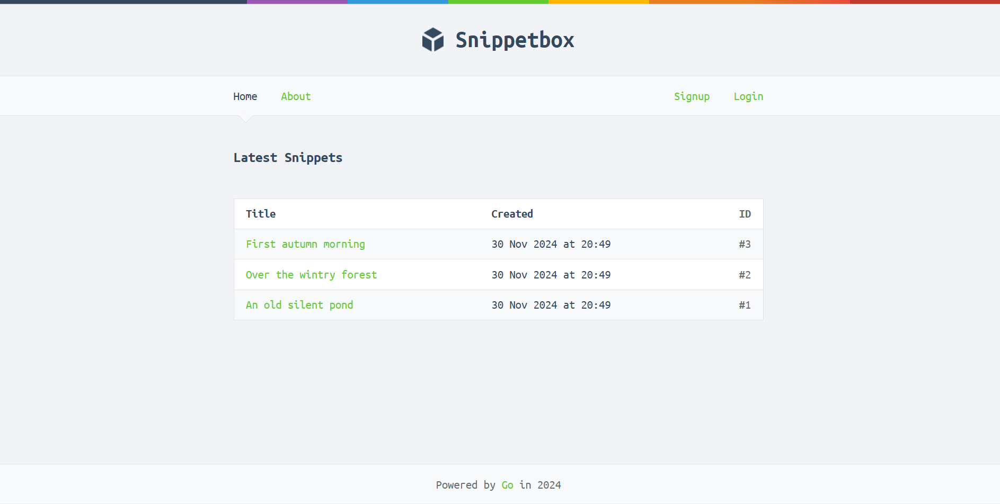

# Snippetbox

This project is an MVC web application built with Go 1.23. It was developed following the [_Let's Go_ ](https://lets-go.alexedwards.net/) book by Alex Edwards. It implements  the following concepts:

- Configuration management
- Logging and error handling
- SQL Database connection
- HTML templating
- Middlewares
- Form Validation
- Server session management
- Authentication and authorization
- Secutiry concerns
- Testing

## Getting started

### Setup the HTTPS connection

To run the server with a local HTTPS connection, a TLS certificate is required. To get a certificate for development environment you can use the `crypt/tls` Go package. It includes the `generate_cert.go` tool, wich generates a self-signed certificate. To use this tool, run the following commands:

```sh
$ mkdir tls
$ cd tls
$ go run /usr/local/go/src/crypto/tls/generate_cert.go --rsa-bits=2048 --host=localhost
```

### Setup the database container

The web app uses a MySQL database to persist user data. You can set up a Docker container running a MySQL image with a clean database using the following command:

```sh
$ docker compose up -d
```

The database schema will be set up by the [`init.sql`](./mysql-init/init.sql) script. It creates the database tables and seeds them with initial data. It also creates a separate database and user to run the integration test without any side effects on the main database.

### Run the project

Execute the following command:

```sh
$ go run ./cmd/web
```

## Dependencies

- [alexedwards/scs](https://github.com/alexedwards/scs): A server side session management tool.
- [go-playground/form](https://github.com/go-playground/form): A form parser to get the fields value.
- [go-sql-driver/mysql](https://github.com/go-sql-driver/mysql): A MySQL driver.
- [justinas/alice](https://github.com/justinas/alice): A middleware chaining tool.
- [justinas/nosurf](https://github.com/justinas/nosurf): A middleware to prevent CSRF vulnerability.
- [golang.org/x/crypto](https://cs.opensource.google/go/x/crypto): Cryptography tool to handle password hashing.
